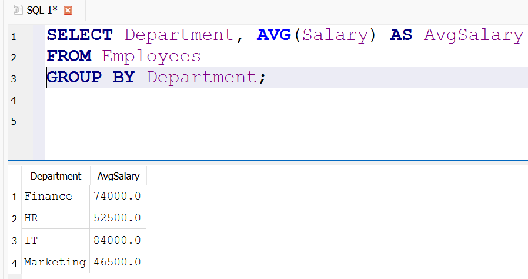
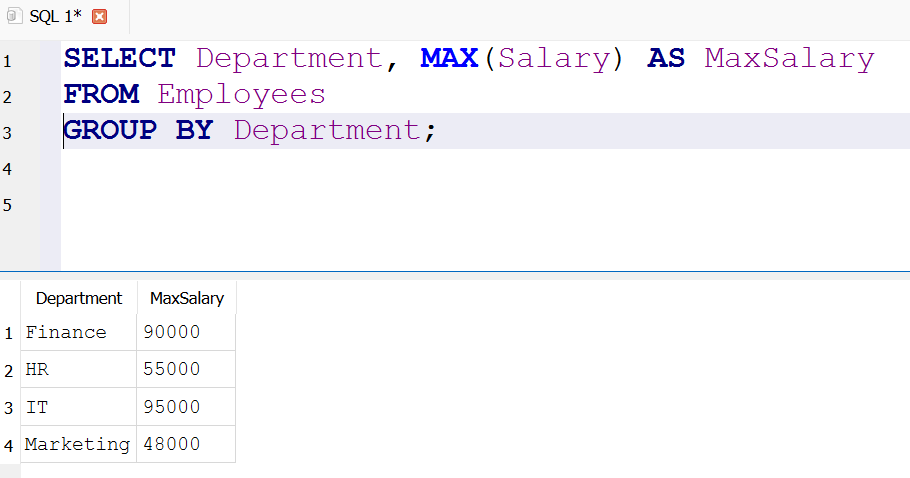

# Employee Analytics (SQL) — demo project

## Overview
Small HR-style database to practice SQL basics (SELECT, WHERE, GROUP BY, JOIN, aggregates, subqueries).

## Files
- `employees.sql` — schema + sample rows
- `queries.sql` — sample queries (with business questions)
- `results/` — (optional) add screenshots or CSV outputs here

## How to run (fast)
Option A (no install): Use DB Fiddle (db-fiddle.com).  
Option B (local): Use DB Browser for SQLite or `sqlite3`.

Steps:
1. Run `employees.sql` to create table + data.
2. Run queries from `queries.sql` and save screenshots or CSVs into `results/`.

## Example Results

**Average Salary by Department**

**Highest Salary Employee**

## Example insights
- IT contains highest paid staff.
- Finance shows the widest salary range.

Author: Ritu — aspiring analyst
